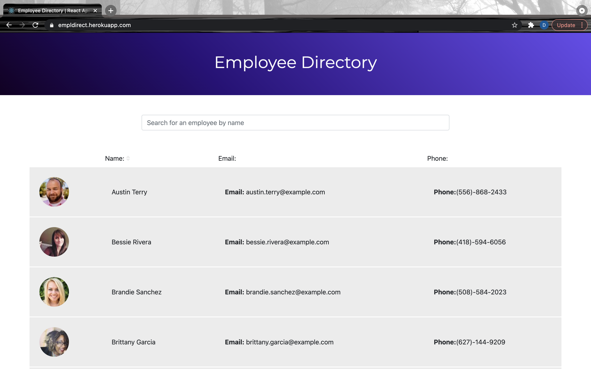

<h1 align="center"> Employee Directory 👋 </h1> 

  ## Description

 This app was built using React.js. It pulls random employees data from an API call and arranges it into cards, which can be sorted by name or title.

 [Heroku Deployed App](https://empldirect.herokuapp.com/)

  ## Table of Contents

  * [Description](#Description)
  * [Usage](#Usage)
  * [Contribute](#Contribute) 
  * [Tech Used](#tech-used)
  * [License](#License)
  * [Questions](#Questions)

  ## Usage

  

  - Once the employee results load, click on the Name header to sort the table alphabetically from A - Z or Z - A by name. 

  🚀 Demos:
  --
  
   
   
  

  ## Tech Used

  - React
  - Node
  - Heroku
  - axios
  
  ## Questions

  Please visit my 
   [GitHub profile](https://github.com/dorley1993/) to check out this and other projects I've created and contributed to.

   Another way to get ahold of me is my email, visit my main dashboard to view my email. 

  ## License  

    Copyright © Danielle Orley 

    licensed under MIT